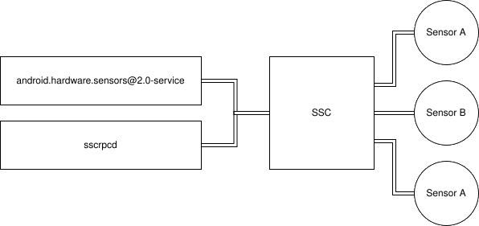

# Qualcomm SDM845 Snapdragon Sensorcore

The SDM845 and newer Qualcomm SoCs contain a Qualcomm Snapdragon Sensor Core (SSC) which exposes the device's sensors over QRTR to the main CPU. The SSC allows the main CPU to fully idle or suspend while the sensors are still running, for example: detect proximity and wake up the device. Moreover, it controls the sensors and sampling to maximize battery life when in use.

## Architecture
The SSC resides on the SPLI aDSP in the SDM845. Accessing the sensors directly is impossible, we have to communicate with the SSC. The SSC communicates to userspace through 2 daemons:



- **android.hardware.sensors** (@1.0-service on Oneplus 6, @2.0-service on SHIFT6mq)
  - Exposes the sensors to Android.
  - Sends and receives messages over QMI with a Protobuf payload.
  - Waits until sscrpd is done before starting, achieved through init scripts.
- **sscrpd**
  - FastRPC daemon which talks to the SSC.
  - Reads various JSON configs from the persist partition which the SSC needs to control the sensors such as bus type (I2C, I3C, ...), bus address, etc.
  - Only reads the JSON configs at boot, does not much do anything besides that.

## Communication
The SSC communicates, like any other Qualcomm device, over QMI (Qualcomm Message Interface) messages. However, QMI is only used here as a envelope for the actual data, which is encoded in [Google's Protocol Buffers (Protobuf)](https://developers.google.com/protocol-buffers/) which was discovered by analyzing the binary data from an strace dump and executing the strings command on the various sensor libraries on downstream. It became clear that the data at some point did not match anymore with the one from QMI, but required some kind of structure, so trial-and-error resulted in discovering Protobuf as encoding scheme. ProtoBuf compiles data structures in a binary format to optimize the data transfer and make sure that the encoding and decoding remains consistent when fields are added or removed.
QMI messages contain a predefined header and a set of [TLV (Type-Length-Value) structures](https://en.wikipedia.org/wiki/Type%E2%80%93length%E2%80%93value), therefore they always look like this (see [this blogpost](https://emainline.gitlab.io/2022/04/08/Unlocking_SSC_P2.html) for a detailed explanation):

**Header**
```
{
    type: uint8,
    txn_id: uint16,
    msg_id: uint16,
    msg_len: uint16
}
```

**TLVs**
```
{
    type: uint8,
    length: uint16,
    value: length * uint8
}
```

Protobuf messages are compiled from a scheme defined in `*.proto` files. However, these files are not publicly available so we have to resort to reverse-engineering them. When we have a Protobuf message, we can give it to a tool such as [protobuf-inspector](https://github.com/mildsunrise/protobuf-inspector) to reveal their structure and content.

### Stracing the sensor HAL on downstream
[-emainline blogpost](https://emainline.gitlab.io/2022/04/08/Unlocking_SSC_P2.html) explains amazingly well already how to reveal the Qualcomm Sensorcore messages using strace. However, the Sensorcore on SDM845 is a newer version which does not use QMI messages for the payload, but protobuf instead. Luckily, the same instructions apply, just the part about decoding the messages differs:

1. Get an ADB shell with root permissions (only works on LineageOS builds!):
   - `adb root # if necessary use sudo if adb complains about permissions`
   - `adb shell`
2. Find the sensor HAL daemon PID: `ps -A | grep android.hardware.sensors`
3. Attach strace to it: `strace -p $PID -f -e trace=sendto,recvfrom -xx -s 1024`
   - `sendto`, `recvfrom` shows all QMI messages being send to and received from the SSC
   - `-f` tells strace to follow subprocesses
   - `-xx` prints all strings as hexadecimal
   - `-s 1024`  to show the complete strings instead of only a part of it.

#### Boot Behavior
Stracing the startup of the daemon shows some useful information: it queries the SSC for all available sensors and subscribes to them. For each type of sensor data (proximity, gravity, etc.) it asks for the SSC registry (see further) if there's a sensor available. If so, the SSC returns the sensor IDs for all sensors providing this type of sensor data. These sensor IDs are used later on for performing operations.

#### Screen state behavior
Interesting is that the SSC sensors are not always enabled. If the screen is OFF, only a few sensors like the proximity sensor is enabled. When the screen is turned ON, other sensors like the accelerometer and gyroscope output data to the sensor HAL daemon.

#### Applications requiring specific sensors
Some sensors are specific to applications such a compass for navigation applications. These sensors are only enabled on-demand to save power. 

### Stracing the sscrpcd daemon on downstream
The `sscrpcd` is a pain to strace, it only does it thing at boot so you need to make sure that the service fails somehow. This way, you can start it manually and strace the boot sequence.

1. Get an ADB shell with root permissions (only works on LineageOS builds!):
   - `adb root # if necessary use sudo if adb complains about permissions`
   - `adb remount # we need RW access`
   - `adb shell`
2. Android is a pain with its read-only rootFS, you need to remount /vendor first since we want to modify the services there (adb remount doesn't cut it here completely): `mount -o rw,remount /vendor`
3. Open to `/vendor/etc/init/hw/init.qcom.rc` and change the service description for `sscrpcd` to (add `/bin/strace` which breaks startup, thanks SELinux, disabling the service the right way makes Android angry):

```
service vendor.sensors /bin/strace /vendor/bin/sscrpcd sensorspd
        class early_hal
        user system
        group system wakelock
        capabilities BLOCK_SUSPEND
        writepid /dev/cpuset/system-background/tasks
```

4. Reboot, LineageOS will keep showing the load animation as it will try to start the service but fails horribly thanks to SELinux not being happy with our voodoo from above.
5. Run strace (needs a reboot each time you want to run it!):
   - Everything interesting: `strace -f -s 2048 -e trace=recvfrom,sendto,file,desc,open,close /vendor/bin/sscrpcd 2>/cache/log.txt`
   - `ioctl`s for FastRPC (fd 8 is the FastRPC one): `strace -f -s 2048 -e raw=ioctl -e trace=ioctl -e read=8 -e write=8 /vendor/bin/sscrpcd 2>/cache/log-ioctl.txt`

This took a few days to locate this daemon and getting an strace dump from it with useful data.

#### Boot behavior
Reads the some files and configs of the sensors in `/mnt/persist/vendor/` and `/vendor/etc/sensors` and execute FastRPC calls (`ioctl`) after accessing each file. Does not do anything besides that during its life cycle.

### PoC on mainline

Now that we pretty well known how the SSC talks with the sensor HAL daemon and `sscrpcd`, we should try to write a PoC to query the sensors like the sensor HAL daemon does on startup. The daemon can open a QRTR connection to the SSC and send/receive QMI messages. That's all!

### Decoding SSC messages
Analyzing the strace dumps revealed that QMI is only used as an envelope and the actual messages are Protobuf-only. We will first decode the QMI part and then decode all the Protobuf messages.

**Let's take the following message from an strace dump:**
```
[pid  6859] recvfrom(17, "\x04\x05\x00\x22\x00\x53\x00\x01\x08\x00\xa9\x19\x00\x00\x00\x00\x00\x00\x02\x45\x00\x43\x00\x0a\x12\x09\xab\xab\xab\xab\xab\xab\xab\xab\x11\xab\xab\xab\xab\xab\xab\xab\xab\x12\x2d\x0d\x00\x03\x00\x00\x11\x8a\xa3\x6a\x89\x3c\x35\x00\x00\x1a\x1d\x0a\x07\x67\x72\x61\x76\x69\x74\x79\x12\x12\x09\x2e\xf5\x5b\xf6\xc0\x98\x43\xa7\x11\xa5\xa6\x50\x68\x2d\x5a\xd4\xc5", 62024, MSG_DONTWAIT, {sa_family=AF_IB, sa_data="\x00\x00\x02\x00\x00\x00\x09\x00\x00\x00\x11\x00\x00\x00\x00\x00\x00\x00"}, [20]) = 90
```

#### QMI part
All Protobuf messages start with `\x0a\x12`, so everything before that is QMI:

```
04 05 00 22 00 53 00 01 08 00 a9 19 00 00 00 00 00 00 02 45 00 43 00
```
Thanks to a [-emainline blogpost](http://If we translate the QMI message using the TLV structure as explained [here](https://emainline.gitlab.io/2022/04/08/Unlocking_SSC_P2.html):), decoding the QMI part is straightforward. We need to extract the QMI header and all its TLVs:

**Header**

- `04` = QMI INDICATION (uint8)
- `05 00` = txn_id (uint16)
- `22 00` = msg_id (uint16)
- `53 00` = msg_length (uint16)

Header is 7 bytes long.

Here is the QMI message an indication. That means that the message doesn't expect a reply. Other possibilities are QMI REQUEST and QMI RESPONSE.

**TLV1**

- Type: `01`
- Length: `08 00`
- Value: `91 00 00 00 00 00 00 00`

The first TLV indicates the client ID of the QMI client.

**TLV2**

- Type: `02`
- Length: `45 00`
- Value: `43 00 0a 12 09 ab ab ab ab ab ab ab ab 11 ab ab ab ab ab ab ab ab 12 2d 0d 00 03 00 00 11 a2 9c d6 2c 4a 00 00 00 1a 1d 0a 07 67 72 61 76 69 74 79 12 12 09 2e f5 5b f6 c0 98 43 a7 11 a5 a6 50 68 2d 5a d4 c5`

The second TLV contains the actual Protobuf message. Interesting here is that the TLV's value contains 43 00 besides the actual Protobuf message (remember that they start with `0a 12`).
This field is 2 bytes long, the Protobuf data is 67 bytes, together 69 bytes which matches exactly the TLV's length (`45 00` = 69). So this probably specifies the length of the Protobuf message:

```
{
    type: uint8,
    length: uint16,
    value: {
        protobuf_length: uint8,
        protobuf_msg: protobuf_length * uint8
    }
}
```

Now that we can communicate with the SSC over QMI, we should have some content in our messages, that's where Protobuf comes in!

#### Protobuf part
The Protobuf payload of each QMI message is the actual content we need to decode. If we run the message from above through protobuf-inspector, we get the following:

```
printf "%b" "\x0a\x12\x09\xab\xab\xab\xab\xab\xab\xab\xab\x11\xab\xab\xab\xab\xab\xab
\xab\xab\x12\x2d\x0d\x00\x03\x00\x00\x11\xa2\x9c\xd6\x2c\x4a\x00\x00\x00\x1a\x1d\x0a\x07\x67\x72\x61\x76\x69\x74\x79\x
12\x12\x09\x2e\xf5\x5b\xf6\xc0\x98\x43\xa7\x11\xa5\xa6\x50\x68\x2d\x5a\xd4\xc5" | protobuf_inspector
root:
    1 <chunk> = message:
        1 <64bit> = 0xABABABABABABABAB / -6076574518398440533 / -2.5301707e-98
        2 <64bit> = 0xABABABABABABABAB / -6076574518398440533 / -2.5301707e-98
    2 <chunk> = message:
        1 <32bit> = 0x00000300 / 768 / 1.07620e-42
        2 <64bit> = 0x0000004A2CD69CA2 / 318579842210 / 1.5739936e-312
        3 <chunk> = message:
            1 <chunk> = "gravity"
            2 <chunk> = message:
                1 <64bit> = 0xA74398C0F65BF52E / -6394099091401607890 / -1.5178000e-119
                2 <64bit> = 0xC5D45A2D6850A6A5 / -4191626202104944987 / -2.5194872e+28
```

The binary data representing the QMI message was removed in the example above
so we only have the protobuf encoded data for the inspector.
The inspector identifies the structure and value types, sometimes by guessing.
However, it doesn't know what each field actually means. 

Luckily, we can guess the meaning of each field by analyzing more strace dumps,
this resulted in the following structure after reverse-engineering:

```
{
	unknown1: {
		unknown1a: 64bit, # constant
		unknown1b: 64bit  # constant
	},
	unknown2: {
		type: 32bit, # different numbers are given here but with a recurring pattern, so probably some enum
		unknown2a: 64bit # increments in time, probably timestamp
		data: {
			sensor: string, # kind of data is specified as string, example: gravity, proximity, etc.
			values: {
				unknown2b: 64bit,
				unknown2c: 64bit
			}
		}
	}
}
```

This information can be put in `protobuf-inspector` by creating the following `protobuf_config.py` file:

```
# data blob
types = {
    "root": {
        1: ("header", "header"),
        2: ("data", "data") 
    },
    "header": {
        1: ("64bit", "unknown1"),
        2: ("64bit", "unknown1")
    },
    "data": {
        1: ("32bit", "type"),
        2: ("64bit", "timestamp"),
        3: ("payload", "payload")
    },
    "payload": {
        1: ("string", "type"),
        2: ("measurements", "measurements")
    },
    "measurements": {
        1: ("64bit", "unknown3"),
        2: ("64bit", "unknown4")
    }
}
```

Thanks to this scheme, `protobuf-inspector` can show a bit more information:

```
root:
    1 header = header:
        1 unknown1 = 0xABABABABABABABAB / -6076574518398440533 / -2.5301707e-98
        2 unknown1 = 0xABABABABABABABAB / -6076574518398440533 / -2.5301707e-98
    2 data = data:
        1 type = 768
        2 timestamp = 318579842210
        3 payload = payload:
            1 type = "gravity"
            2 measurements = measurements:
                1 unknown3 = 0xA74398C0F65BF52E / -6394099091401607890 / -1.5178000e-119
                2 unknown4 = 0xC5D45A2D6850A6A5 / -4191626202104944987 / -2.5194872e+28
```

Given that we know this is a gravity data message, we would expect 3 data values: X, Y, Z since gravity sensors always report the gravity for the X, Y, Z.
Let's try some bruteforcing since the inspector is clearly wrong here with its guess.
Gravity is mostly provided as a floating point number, so we can try that one first:

```
root:
    1 header = header:
        1 unknown1 = 0xABABABABABABABAB / -6076574518398440533 / -2.5301707e-98
        2 unknown1 = 0xABABABABABABABAB / -6076574518398440533 / -2.5301707e-98
    2 data = data:
        1 type = 768
        2 timestamp = 318579842210
        3 payload = payload:
            1 type = "gravity"
            2 measurements = measurements:
                1 unknown3 = ERROR: Traceback...
                2 <64bit> = 0xC5D45A2D6850A6A5 / -4191626202104944987 / -2.5194872e+28
```

After some trial-and-error, you need to re-evaluate your previous assumptions as you may have assumed something wrong.
Maybe this is not a data message, but another one? Given that the SSC needs to know how to operate a sensor given a request
from userspace, this might be a configuration message?
It is kinda hard to make any sense of the measurements message, we need to analyze other messages first to find more patterns. 

## Example: Sensor properties message

We selected another random message that didn't look like the previous one for decoding and reverse-engineering.
We immediately see something similar between this message and the previous one, it has the same
kind of header and a data message with a type and timestamp. So we can assume this part is more or less correct.
Timestamp doesn't match any UNIX timestamp encoding, but in the end we don't need this value not really for our purposes.

```
root:
    1 header = header:
        1 unknown1 = 0xAF4002DC9CB83279 / -5818647572017302919 / -4.2198254e-81
        2 unknown1 = 0x973615C0C0808FA3 / -7550823807632502877 / -7.3861769e-197
    2 data = data:
        1 type = 0x00000080 / 128 / 1.79366e-43
        2 timestamp = 0x0000004A2E9097AA / 318608807850 / 1.5741367e-312
        3 payload = payload:
            1 <chunk> = message:
                1 <varint> = 0
                2 <chunk> = message:
                    1 <chunk> = message:
                        2 <chunk> = bytes (8)
                            0000   6C 73 6D 36 64 73 6D 00                                                  lsm6dsm.
            1 <chunk> = message:
                1 <varint> = 1
                2 <chunk> = message:
                    1 <chunk> = message:
                        2 <chunk> = bytes (8)
                            0000   53 54 4D 69 63 72 6F 00                                                  STMicro.
            1 <chunk> = message:
                1 <varint> = 4
                2 <chunk> = message:
                    1 <chunk> = message:
                        4 <64bit> = 0x000000000002250A / 140554 / 6.9442903e-319
            1 <chunk> = message:
                1 <varint> = 8
                2 <chunk> = message:
                    1 <chunk> = message:
                        4 <64bit> = 0x0000000000000000 / 0 / 0.0000000
            1 <chunk> = message:
                1 <varint> = 12
                2 <chunk> = message:
                    1 <chunk> = message:
                        2 <chunk> = bytes (4)
                            0000   4C 50 4D 00                                                              LPM.
                    1 <chunk> = message:
                        2 <chunk> = bytes (7)
                            0000   4E 4F 52 4D 41 4C 00                                                     NORMAL.
                    1 <chunk> = message:
                        2 <chunk> = "HIGH_PERF\x00"
            1 <chunk> = message:
                1 <varint> = 15
                2 <chunk> = message:
                    1 <chunk> = message:
                        4 <64bit> = 0x0000000000000008 / 8 / 3.9525252e-323
            1 <chunk> = message:
                1 <varint> = 16
                2 <chunk> = message:
                    1 <chunk> = message:
                        4 <64bit> = 0x0000000000000000 / 0 / 0.0000000
            1 <chunk> = message:
                1 <varint> = 17
                2 <chunk> = message:
                    1 <chunk> = message(5 <varint> = 0)
            1 <chunk> = message:
                1 <varint> = 19
                2 <chunk> = message:
                    1 <chunk> = message:
                        4 <64bit> = 0x0000000000000000 / 0 / 0.0000000
            1 <chunk> = message:
                1 <varint> = 20
                2 <chunk> = message:
                    1 <chunk> = message:
                        3 <32bit> = 0x3DCCCCCD / 1036831949 / 0.100000
                    1 <chunk> = message:
                        3 <32bit> = 0x3DCCCCCD / 1036831949 / 0.100000
                    1 <chunk> = message:
                        3 <32bit> = 0x3DCCCCCD / 1036831949 / 0.100000
                    1 <chunk> = message:
                        3 <32bit> = 0x00000000 / 0 / 0.00000
                    1 <chunk> = message:
                        3 <32bit> = 0x00000000 / 0 / 0.00000
                    1 <chunk> = message:
                        3 <32bit> = 0x00000000 / 0 / 0.00000
                    1 <chunk> = message:
                        3 <32bit> = 0x00000000 / 0 / 0.00000
                    1 <chunk> = message:
                        3 <32bit> = 0x00000000 / 0 / 0.00000
                    1 <chunk> = message:
                        3 <32bit> = 0x00000000 / 0 / 0.00000
                    1 <chunk> = message:
                        3 <32bit> = 0x00000000 / 0 / 0.00000
                    1 <chunk> = message:
                        3 <32bit> = 0x00000000 / 0 / 0.00000
                    1 <chunk> = message:
                        3 <32bit> = 0x00000000 / 0 / 0.00000
            1 <chunk> = message:
                1 <varint> = 18
                2 <chunk> = message:
                    1 <chunk> = message:
                        4 <64bit> = 0x0000000000000000 / 0 / 0.0000000
            1 <chunk> = message:
                1 <varint> = 13
                2 <chunk> = message:
                    1 <chunk> = message(5 <varint> = 0)
            1 <chunk> = message:
                1 <varint> = 21
                2 <chunk> = message:
                    1 <chunk> = message(5 <varint> = 1)
            1 <chunk> = message:
                1 <varint> = 14
                2 <chunk> = message:
                    1 <chunk> = message(5 <varint> = 0)
            1 <chunk> = message:
                1 <varint> = 3
                2 <chunk> = message:
                    1 <chunk> = message(5 <varint> = 1)
            1 <chunk> = message:
                1 <varint> = 6
                2 <chunk> = message:
                    1 <chunk> = message:
                        3 <32bit> = 0x3F800000 / 1065353216 / 1.00000
                    1 <chunk> = message:
                        3 <32bit> = 0x40A00000 / 1084227584 / 5.00000
            1 <chunk> = message:
                1 <varint> = 2
                2 <chunk> = message:
                    1 <chunk> = message:
                        2 <chunk> = "sensor_temperature\x00"
            1 <chunk> = message:
                1 <varint> = 7
                2 <chunk> = message:
                    1 <chunk> = message:
                        3 <32bit> = 0x3B7F9724 / 998217508 / 0.00390000
            1 <chunk> = message:
                1 <varint> = 9
                2 <chunk> = message:
                    1 <chunk> = message:
                        4 <64bit> = 0x0000000000000018 / 24 / 1.1857576e-322
                    1 <chunk> = message:
                        4 <64bit> = 0x0000000000000046 / 70 / 3.4584595e-322
                    1 <chunk> = message:
                        4 <64bit> = 0x00000000000000F0 / 240 / 1.1857576e-321
            1 <chunk> = message:
                1 <varint> = 10
                2 <chunk> = message:
                    1 <chunk> = message:
                        4 <64bit> = 0x0000000000000006 / 6 / 2.9643939e-323
            1 <chunk> = message:
                1 <varint> = 5
                2 <chunk> = message:
                    1 <chunk> = message:
                        2 <chunk> = "sns_sensor_temperature.proto\x00"
            1 <chunk> = message:
                1 <varint> = 22
                2 <chunk> = message:
                    1 <chunk> = message:
                        4 <64bit> = 0x0000000000000003 / 3 / 1.4821969e-323
            1 <chunk> = message:
                1 <varint> = 11
                2 <chunk> = message:
                    1 <chunk> = message:
                        1 <chunk> = message:
                            1 <chunk> = message:
                                3 <32bit> = 0xC2200000 / -1038090240 / -40.0000
                            1 <chunk> = message:
                                3 <32bit> = 0x42AA0000 / 1118437376 / 85.0000
            1 <chunk> = message:
                1 <varint> = 23
                2 <chunk> = message:
                    1 <chunk> = message:
                        3 <32bit> = 0x3B7F9724 / 998217508 / 0.00390000
            1 <chunk> = message:
                1 <varint> = 24
                2 <chunk> = message:
                    1 <chunk> = message:
                        1 <chunk> = message:
                            1 <chunk> = message:
                                3 <32bit> = 0xC2200000 / -1038090240 / -40.0000
                            1 <chunk> = message:
                                3 <32bit> = 0x42AA0000 / 1118437376 / 85.0000

```

If we look at the other values, we can spot immediately some strings like `lsm6dsm` and `STMicro`.
Moreover, we also see some data specifying some kind of ranges, for example `-40.000` and `85.000`
which looks like the operating temperature range for a sensor. This sensor is a temperature sensor,
so it would make sense to know which temperature values can be considered valid and which not.
Since the name of the sensor is provided by a string, we can have a look at the datasheet.
Indeed, the [datasheet](https://www.st.com/resource/en/datasheet/lsm6dsm.pdf) confirms our hypothesis regarding the ranges, great!
Given that our hypothesis is confirmed, we can apply the same to other properties.
This message provides us a list of operating ranges and the current selected ranges of the sensor.
We also spot `LPM`, `NORMAL` and `HIGH_PERF` strings but they are not in the datasheet.
After checking similar messages, this comes back each time, for different sensor types which
may point to how the SSC operates the sensor. Given that the goal of the SSC is to offload and minimize
battery use, we can assume the following:

- `LPM` = Low Power Mode operation, probably in use when the device is sleeping
- `NORMAL` = Normal operation, probably when the device is in use
- `HIGH_PERF` = High accurate and performant operation, probably when the sensor data is really important like accelerometer data for navigation apps

Another interesting pattern is that each range message contains a `varint` with a number.
Given that these are various properties about a sensor, it is probably an enum where each number
matches a property like:

```
enum {
	SENSOR_NAME = 0, # obvious: name of sensor as string
	SENSOR_MANUFACTURER = 1, # obvious: name of manufacturer as string
	SENSOR_DATATYPE = 2, # probably the sensor datatype as string
	SENSOR_UNKNOWN1 = 3,
	SENSOR_UNKNOWN2 = 4,
	SENSOR_PROTOFILE = 5, # matches with SENSOR_DATATYPE, so probably right
	SENSOR_UNKNOWN3 = 6,
	SENSOR_UNKNOWN4 = 7,
	SENSOR_UNKNOWN5 = 8,
	SENSOR_UNKNOWN6 = 9,
	SENSOR_UNKNOWN7 = 10,
	SENSOR_OPERATING_RANGE = 11, # temperature sensor operates between -40 and 85 degrees Celsius according to datasheet
	SENSOR_OPERATING_MODE = 12, # LPM/NORMAL/HIGH_PERF see higher
	SENSOR_UNKNOWN8 = 13,
	SENSOR_UNKNOWN9 = 14,
	SENSOR_UNKNOWN10 = 15,
	SENSOR_UNKNOWN11 = 16,
	SENSOR_UNKNOWN12 = 17,
	SENSOR_UNKNOWN13 = 18,
	SENSOR_UNKNOWN14 = 19,
	SENSOR_DEVICE_MOUNT_MATRIX = 20, # device orientation. Gyroscopes and accelerometers needs to specify how they are placed relative to the device orientation
	SENSOR_UNKNOWN15 = 21,
	SENSOR_UNKNOWN16 = 22,
	SENSOR_UNKNOWN17 = 23, # same value as SENSOR_UNKNOWN4, maybe this is selected value? Since only one is available, we are not certain
	SENSOR_SELECTED_RANGE = 24, # Available ranges are listed and one is current active	
	SENSOR_UNKNOWN18 = 25,
	SENSOR_UNKNOWN19 = 26
}
```

Weird thing is this LSM6DSM is advertised as an always-on 3D accelerometer and 3D gyroscope, but provides temperature information?
Again, the datasheet is golden and specifies that the sensor has an embedded temperature sensor, probably for correcting the accelerometer and gyroscope data!

## Example: proximity sensor data

Since we still haven't found a data message, we ran strace a bit longer while turning off the screen.
Turning off the screen resulted in less noise in the strace dump, so it seems that the SSC suspends several sensors in that case.
However, not all of them are suspended. If you waive your hand over the phone you still get some messages.
The only sensor that can act on such events, is a proximity sensor, so it must be a data message!

**Protobuf dumps**
```
\x0a\x12\x09\x8c\x6c\xeb\x8f\x24\x49\x4e\xc3\x11\x85\x09\x5c\x1e\x01\xa4\xeb\x15\x12\x21\x0d\x03\x04\x00\x00\x11\x7e\xee\x0c\x60\x1f\x3d\x00\x00\x1a\x11\x0d\x00\x00\x80\x3f\x0d\x00\x00\xa8\x42\x0d\x00\x00\x00\x00\x10\x03
\x0a\x12\x09\x8c\x6c\xeb\x8f\x24\x49\x4e\xc3\x11\x85\x09\x5c\x1e\x01\xa4\xeb\x15\x12\x21\x0d\x03\x04\x00\x00\x11\x73\x08\xee\x61\x1f\x3d\x00\x00\x1a\x11\x0d\x00\x00\x00\x00\x0d\x00\x00\x0c\x42\x0d\x00\x00\x00\x00\x10\x03
\x0a\x12\x09\x8c\x6c\xeb\x8f\x24\x49\x4e\xc3\x11\x85\x09\x5c\x1e\x01\xa4\xeb\x15\x12\x21\x0d\x03\x04\x00\x00\x11\x09\x23\x62\x66\x1f\x3d\x00\x00\x1a\x11\x0d\x00\x00\x80\x3f\x0d\x00\x00\xac\x42\x0d\x00\x00\x00\x00\x10\x03
\x0a\x12\x09\x8c\x6c\xeb\x8f\x24\x49\x4e\xc3\x11\x85\x09\x5c\x1e\x01\xa4\xeb\x15\x12\x21\x0d\x03\x04\x00\x00\x11\x6c\x90\x52\x67\x1f\x3d\x00\x00\x1a\x11\x0d\x00\x00\x00\x00\x0d\x00\x00\x14\x42\x0d\x00\x00\x00\x00\x10\x03
```

This dump is extracted from our strace dump and contains 4 messages which can be decoded using protobuf-inspector:

```
root:
    1 <chunk> = message:
        1 <64bit> = 0xC34E49248FEB6C8C / -4373477766747951988 / -1.7049341e+16
        2 <64bit> = 0x15EBA4011E5C0985 / 1579536419034761605 / 4.4079947e-203
    2 <chunk> = message:
        1 <32bit> = 0x00000403 / 1027 / 1.43913e-42
        2 <64bit> = 0x00003D1F600CEE7E / 67204964740734 / 3.3203664e-310
        3 <chunk> = message:
            1 <32bit> = 0x3F800000 / 1065353216 / 1.00000
            1 <32bit> = 0x42A80000 / 1118306304 / 84.0000
            1 <32bit> = 0x00000000 / 0 / 0.00000
            2 <varint> = 3

root:
    1 <chunk> = message:
        1 <64bit> = 0xC34E49248FEB6C8C / -4373477766747951988 / -1.7049341e+16
        2 <64bit> = 0x15EBA4011E5C0985 / 1579536419034761605 / 4.4079947e-203
    2 <chunk> = message:
        1 <32bit> = 0x00000403 / 1027 / 1.43913e-42
        2 <64bit> = 0x00003D1F61EE0873 / 67204996270195 / 3.3203680e-310
        3 <chunk> = message:
            1 <32bit> = 0x00000000 / 0 / 0.00000
            1 <32bit> = 0x420C0000 / 1108082688 / 35.0000
            1 <32bit> = 0x00000000 / 0 / 0.00000
            2 <varint> = 3

root:
    1 <chunk> = message:
        1 <64bit> = 0xC34E49248FEB6C8C / -4373477766747951988 / -1.7049341e+16
        2 <64bit> = 0x15EBA4011E5C0985 / 1579536419034761605 / 4.4079947e-203
    2 <chunk> = message:
        1 <32bit> = 0x00000403 / 1027 / 1.43913e-42
        2 <64bit> = 0x00003D1F66622309 / 67205070988041 / 3.3203717e-310
        3 <chunk> = message:
            1 <32bit> = 0x3F800000 / 1065353216 / 1.00000
            1 <32bit> = 0x42AC0000 / 1118568448 / 86.0000
            1 <32bit> = 0x00000000 / 0 / 0.00000
            2 <varint> = 3

root:
    1 <chunk> = message:
        1 <64bit> = 0xC34E49248FEB6C8C / -4373477766747951988 / -1.7049341e+16
        2 <64bit> = 0x15EBA4011E5C0985 / 1579536419034761605 / 4.4079947e-203
    2 <chunk> = message:
        1 <32bit> = 0x00000403 / 1027 / 1.43913e-42
        2 <64bit> = 0x00003D1F6752906C / 67205086744684 / 3.3203725e-310
        3 <chunk> = message:
            1 <32bit> = 0x00000000 / 0 / 0.00000
            1 <32bit> = 0x42140000 / 1108606976 / 37.0000
            1 <32bit> = 0x00000000 / 0 / 0.00000
            2 <varint> = 3
```

Interesting! The header of the messages report different values than our gravity and temperature sensor from above.
Moreover, the type of the data message `1027` is also different, so this might be the enum value for reporting data values.
The other types from the previous examples are configuration messages.

Proximity is either near or not, so the first part of our data message reports either a `0` or `1` when the proximity sensor is covered or not by our hand.
```
{
	SENSOR_PROXIMITY_FAR = 0,
	SENSOR_PROXIMITY_NEAR = 1
}
```


The datasheet of the sensor indicates that is also an ambilight sensor.
The second value is probably the light intensity reported in [lux](https://en.wikipedia.org/wiki/Lux).
The third value is always `0`, so probably not in use.
The last value is always `3` and it seems to appear in more data messages as well,
this could be some kind of status regarding the provided data?

## Turning on display enables several sensors

Something we noticed is that turning on/off the device's display would trigger
some communication between the main CPU and the SSC.
After isolating these messages in the strace dump and running them through protobuf-inspector we could see the following:

```
root:
    1 <chunk> = message:
        1 <64bit> = 0x8F4CA34817DEA0AE / -8120936498022408018 / -5.6292862e-235
        2 <64bit> = 0x9C56C73BE530A0BD / -7181333495733509955 / -3.6838589e-172
    2 <chunk> = message:
        1 <32bit> = 0x00000300 / 768 / 1.07620e-42
        2 <64bit> = 0x00003D20B8E10173 / 67210750001523 / 3.3206523e-310
        3 <chunk> = message:
            1 <32bit> = 0x41200000 / 1092616192 / 10.0000
            3 <chunk> = message:
                0 <varint> = 0
                0 <varint> = 0
                0 <varint> = 1163262
            4 <32bit> = 0x3DCCCCCD / 1036831949 / 0.100000
            5 <chunk> = bytes (7)
                0000   4E 4F 52 4D 41 4C 00                                                     NORMAL.
            6 <varint> = 245
            8 <varint> = 1

root:
    1 <chunk> = message:
        1 <64bit> = 0x8F4CA34817DEA0AE / -8120936498022408018 / -5.6292862e-235
        2 <64bit> = 0x9C56C73BE530A0BD / -7181333495733509955 / -3.6838589e-172
    2 <chunk> = message:
        1 <32bit> = 0x00000300 / 768 / 1.07620e-42
        2 <64bit> = 0x00003D20B8E10961 / 67210750003553 / 3.3206523e-310
        3 <chunk> = message:
            1 <32bit> = 0x41200000 / 1092616192 / 10.0000
            3 <chunk> = bytes (8)
                0000   00 00 00 00 00 FF 7F 47                                                  .......G
            4 <32bit> = 0x3DCCCCCD / 1036831949 / 0.100000
            5 <chunk> = bytes (7)
                0000   4E 4F 52 4D 41 4C 00                                                     NORMAL.
            6 <varint> = 245
            8 <varint> = 1

root:
    1 <chunk> = message:
        1 <64bit> = 0x8F4CA34817DEA0AE / -8120936498022408018 / -5.6292862e-235
        2 <64bit> = 0x9C56C73BE530A0BD / -7181333495733509955 / -3.6838589e-172
    2 <chunk> = message:
        1 <32bit> = 0x00000300 / 768 / 1.07620e-42
        2 <64bit> = 0x00003D20B8E59D18 / 67210750303512 / 3.3206523e-310
        3 <chunk> = message:
            1 <32bit> = 0x41200000 / 1092616192 / 10.0000
            3 <chunk> = message:
                0 <varint> = 0
                0 <varint> = 0
                0 <varint> = 1163262
            4 <32bit> = 0x3DCCCCCD / 1036831949 / 0.100000
            5 <chunk> = bytes (7)
                0000   4E 4F 52 4D 41 4C 00                                                     NORMAL.
            6 <varint> = 245
            8 <varint> = 1
```

The header values are again different here from the previous examples.
We still don't know their meaning though.
The type here is `768` and the content of this message looks like setting the operating mode to `NORMAL`.
So we can be sure that the `768` value is an enum value for a control message:

```
{
	MESSAGE_TYPE_PROPERTIES = 128,
	MESSAGE_TYPE_CONFIG = 768,
	MESSAGE_TYPE_DATA = 1027
}
```

A consequence of this is that our gravity example from the beginning was indeed a control message and not
a data message as we first assumed!

Some more messages appeared when turning on the display:

```
root:
    1 <chunk> = message:
        1 <64bit> = 0x8F4CA34817DEA0AE / -8120936498022408018 / -5.6292862e-235
        2 <64bit> = 0x9C56C73BE530A0BD / -7181333495733509955 / -3.6838589e-172
    2 <chunk> = message:
        1 <32bit> = 0x00000401 / 1025 / 1.43633e-42
        2 <64bit> = 0x00003D20B8F063CD / 67210751009741 / 3.3206523e-310
        3 <chunk> = message:
            1 <32bit> = 0x00000000 / 0 / 0.00000
            1 <32bit> = 0x3F800000 / 1065353216 / 1.00000
            2 <varint> = 3
```

This looks like a data message as it has a similar structure as our data message above, but it has a slightly different type.
So maybe the `MESSAGE_TYPE_DATA` is a range [1025, 1027]?
However, it is not clear what the data represents since we don't know the origin sensor.

Yet another control message:

```
root:
    1 <chunk> = message:
        1 <64bit> = 0x4043B5DABF1B397D / 4630744792980732285 / 39.420738
        2 <64bit> = 0x61C572F2EDB31697 / 7045163579786598039 / 9.6497289e+162
    2 <chunk> = message:
        1 <32bit> = 0x00000308 / 776 / 1.08741e-42
        2 <64bit> = 0x00003D20B98C665B / 67210761234011 / 3.3206528e-310
        3 <chunk> = message(1 <varint> = 4)
```

This one configures a sensor to a certain mode `4`, but again not clear which sensor.
The `MESSAGE_TYPE_CONFIG` is probably also a range here: [768, 776].

Another message but with a unseen type:

```
root:
    1 <chunk> = message:
        1 <64bit> = 0x4043B5DABF1B397D / 4630744792980732285 / 39.420738
        2 <64bit> = 0x61C572F2EDB31697 / 7045163579786598039 / 9.6497289e+162
    2 <32bit> = 0x00000202 / 514 / 7.20267e-43
    3 <chunk> = message(1 <varint> = 1, 2 <varint> = 0)
    4 <chunk> = message:
        1 <chunk> = message(1 <varint> = 0)
    2 <varint> = 1
    0 <varint> = 1
```

Since this message appears when turning on the display (which causes several sensors to go into NORMAL mode),
maybe this turns on a sensor which was turned off previously like a barometer (which is not useful in a lower power mode).

```
{
	MESSAGE_TYPE_PROPERTIES = 128,
	MESSAGE_TYPE_ENABLE = 514,
	MESSAGE_TYPE_CONFIG = 768,
	MESSAGE_TYPE_DATA = 1027
}
```

Remember that we had a data message a while back which we didn't know from which sensor it came?
Digging through some more dumps, make it appear several times when moving the device.
The data is always within a range of [0.0, 10.0] during movement. It is around 0.0 when standing still.
This data is probably from an accelerometer or gravity sensor as it reacts on movement!
Futhermore, the values of the header are always like this:

```
1 <chunk> = message:
    1 <64bit> = 0x8F4CA34817DEA0AE / -8120936498022408018 / -5.6292862e-235
    2 <64bit> = 0x9C56C73BE530A0BD / -7181333495733509955 / -3.6838589e-172
```

Since the header matches each time for the same sensor, we can assume this is some kind of ID
of the sensor! Other sensors have different constant values to uniquely identify them.

If we look at some messages which are sent at the startup of the sensor daemon with strace, we can find these:

```
root:
    1 <chunk> = message:
        1 <64bit> = 0xABABABABABABABAB / -6076574518398440533 / -2.5301707e-98
        2 <64bit> = 0xABABABABABABABAB / -6076574518398440533 / -2.5301707e-98
    2 <32bit> = 0x00000200 / 512 / 7.17465e-43
    3 <chunk> = message(1 <varint> = 1, 2 <varint> = 0)
    4 <chunk> = message:
        2 <chunk> = message:
            1 <chunk> = "proximity"
            2 <varint> = 1
            3 <varint> = 1
    2 <varint> = 1
    0 <varint> = 1

root:
    1 <chunk> = message:
        1 <64bit> = 0xABABABABABABABAB / -6076574518398440533 / -2.5301707e-98
        2 <64bit> = 0xABABABABABABABAB / -6076574518398440533 / -2.5301707e-98
    2 <chunk> = message:
        1 <32bit> = 0x00000300 / 768 / 1.07620e-42
        2 <64bit> = 0x0000353C896529B6 / 58534119418294 / 2.8919698e-310
        3 <chunk> = message:
            1 <chunk> = "proximity"
            2 <chunk> = message:
                1 <64bit> = 0x3732444D54736D61 / 3977316519841590625 / 8.1911186e-43
                2 <64bit> = 0x5F5F584F52503532 / 6872308654097315122 / 2.5651075e+151

```

The sensor daemon requests the proximity sensor and gets a reply with some weird hexadecimal codes.
Believe it or not, they match the header of the next messages for that sensor, so that's how 
the sensor ID is retrieved.
Protobuf only supports 32bit or 64bit values, to represent a 128bit values, you need to use 2 times 64bit values.
So the ID of the sensor here is probably a combination of 0x3732444D54736D61 + 0x5F5F584F52503532 = 5.F5F584F52\*10^31.
Since we don't know the protobuf file, we don't know the order of both 64bit values.
However, we don't need to know this as we would need to send them back in the same order anyway.
Message type 512 is to retrieve the sensor ID which is unknown at first and set to `0xABABABABABABABAB` until it is known.

```
{
	MESSAGE_TYPE_PROPERTIES = 128,
	MESSAGE_TYPE_SENSOR_ID = 512,
	MESSAGE_TYPE_ENABLE = 514,
	MESSAGE_TYPE_CONFIG = 768,
	MESSAGE_TYPE_DATA = 1027
}
```

## More property messages

```
root:
    1 <chunk> = message:
        1 <64bit> = 0xB641F37CF0373AD5 / -5313698367388828971 / -2.4565317e-47
        2 <64bit> = 0xB1B5FB056EDEEDA6 / -5641326957458166362 / -3.1847811e-69
    2 <chunk> = message:
        1 <32bit> = 0x00000080 / 128 / 1.79366e-43
        2 <64bit> = 0x0000353C8AC5E1CB / 58534142534091 / 2.8919709e-310
        3 <chunk> = message:
            1 <chunk> = message:
                1 <varint> = 0
                2 <chunk> = message:
                    1 <chunk> = message:
                        2 <chunk> = "TMD3725_RGB\x00"
            1 <chunk> = message:
                1 <varint> = 1
                2 <chunk> = message:
                    1 <chunk> = message:
                        2 <chunk> = bytes (7)
                            0000   61 6D 73 20 41 47 00                                                     ams AG.
            1 <chunk> = message:
                1 <varint> = 2
                2 <chunk> = message:
                    1 <chunk> = message:
                        2 <chunk> = bytes (4)
                            0000   72 67 62 00                                                              rgb.
            1 <chunk> = message:
                1 <varint> = 4
                2 <chunk> = message:
                    1 <chunk> = message:
                        4 <64bit> = 0x0000000000000100 / 256 / 1.2648081e-321
            1 <chunk> = message:
                1 <varint> = 5
                2 <chunk> = message:
                    1 <chunk> = message:
                        2 <chunk> = "sns_rgb.proto\x00"
            1 <chunk> = message:
                1 <varint> = 7
                2 <chunk> = message:
                    1 <chunk> = message:
                        3 <32bit> = 0x3DCCCCCD / 1036831949 / 0.100000
            1 <chunk> = message:
                1 <varint> = 9
                2 <chunk> = message:
                    1 <chunk> = message:
                        4 <64bit> = 0x0000000000000050 / 80 / 3.9525252e-322
            1 <chunk> = message:
                1 <varint> = 10
                2 <chunk> = message:
                    1 <chunk> = message:
                        4 <64bit> = 0x0000000000000001 / 1 / 4.9406565e-324
            1 <chunk> = message:
                1 <varint> = 11
                2 <chunk> = message:
                    1 <chunk> = message:
                        1 <chunk> = message:
                            1 <chunk> = message:
                                3 <32bit> = 0x00000000 / 0 / 0.00000
                            1 <chunk> = message:
                                3 <32bit> = 0x477FFF00 / 1199570688 / 65535.0
            1 <chunk> = message:
                1 <varint> = 12
                2 <chunk> = message:
                    1 <chunk> = message:
                        2 <chunk> = bytes (4)
                            0000   4C 50 4D 00                                                              LPM.
                    1 <chunk> = message:
                        2 <chunk> = bytes (7)
                            0000   4E 4F 52 4D 41 4C 00                                                     NORMAL.
            1 <chunk> = message:
                1 <varint> = 15
                2 <chunk> = message:
                    1 <chunk> = message:
                        4 <64bit> = 0x000000000000000C / 12 / 5.9287878e-323
            1 <chunk> = message:
                1 <varint> = 17
                2 <chunk> = message:
                    1 <chunk> = message(5 <varint> = 0)
            1 <chunk> = message:
                1 <varint> = 21
                2 <chunk> = message:
                    1 <chunk> = message(5 <varint> = 1)
            1 <chunk> = message:
                1 <varint> = 22
                2 <chunk> = message:
                    1 <chunk> = message:
                        4 <64bit> = 0x0000000000000002 / 2 / 9.8813129e-324
                    1 <chunk> = message:
                        4 <64bit> = 0x0000000000000003 / 3 / 1.4821969e-323
            1 <chunk> = message:
                1 <varint> = 3
                2 <chunk> = message:
                    1 <chunk> = message(5 <varint> = 1)
            1 <chunk> = message:
                1 <varint> = 6
                2 <chunk> = message:
                    1 <chunk> = message:
                        3 <32bit> = 0x40000000 / 1073741824 / 2.00000
                    1 <chunk> = message:
                        3 <32bit> = 0x40A00000 / 1084227584 / 5.00000
                    1 <chunk> = message:
                        3 <32bit> = 0x41200000 / 1092616192 / 10.0000
                    1 <chunk> = message:
                        3 <32bit> = 0x41700000 / 1097859072 / 15.0000
                    1 <chunk> = message:
                        3 <32bit> = 0x41A00000 / 1101004800 / 20.0000
                    1 <chunk> = message:
                        3 <32bit> = 0x42480000 / 1112014848 / 50.0000
                    1 <chunk> = message:
                        3 <32bit> = 0x42C80000 / 1120403456 / 100.000
            1 <chunk> = message:
                1 <varint> = 13
                2 <chunk> = message:
                    1 <chunk> = message(5 <varint> = 1)
            1 <chunk> = message:
                1 <varint> = 16
                2 <chunk> = message:
                    1 <chunk> = message:
                        4 <64bit> = 0x0000000000000001 / 1 / 4.9406565e-324
            1 <chunk> = message:
                1 <varint> = 18
                2 <chunk> = message:
                    1 <chunk> = message:
                        4 <64bit> = 0x0000000000000001 / 1 / 4.9406565e-324
```

Remember the config properties messages? Well, with some different sensors messages
we can probably decrypt the other enum values:

```
enum {
	SENSOR_NAME = 0, # obvious: name of sensor as string
	SENSOR_MANUFACTURER = 1, # obvious: name of manufacturer as string
	SENSOR_DATATYPE = 2, # probably the sensor datatype as string
	SENSOR_AVAILABLE = 3,
	SENSOR_UNKNOWN2 = 4,
	SENSOR_PROTOFILE = 5, # matches with SENSOR_DATATYPE, so probably right
	SENSOR_AVAILABLE_RANGES = 6, # confirms hypothesis from above that this is available ranges
	SENSOR_UNKNOWN3 = 7,
	SENSOR_UNKNOWN4 = 8,
	SENSOR_UNKNOWN5 = 9,
	SENSOR_UNKNOWN6 = 10,
	SENSOR_OPERATING_RANGE = 11, # ALS range is [0.0, 65535.0] according to datasheet
	SENSOR_OPERATING_MODE = 12, # LPM/NORMAL/HIGH_PERF see higher
	SENSOR_UNKNOWN7 = 13,
	SENSOR_UNKNOWN8 = 14,
	SENSOR_UNKNOWN9 = 15,
	SENSOR_STREAM_TYPE = 16,
	SENSOR_UNKNOWN11 = 17,
	SENSOR_UNKNOWN12 = 18,
	SENSOR_UNKNOWN13 = 19,
	SENSOR_DEVICE_MOUNT_MATRIX = 20, # device orientation. Gyroscopes and accelerometers needs to specify how they are placed relative to the device orientation
	SENSOR_UNKNOWN14 = 21,
	SENSOR_UNKNOWN15 = 22,
	SENSOR_UNKNOWN16 = 23, # same value as SENSOR_UNKNOWN4, maybe this is selected value? Since only one is available, we are not certain
	SENSOR_SELECTED_RANGE = 24, # Available ranges are listed and one is current active	
	SENSOR_UNKNOWN17 = 25,
	SENSOR_UNKNOWN18 = 26
}
```

Stream type can be:

- Continuous `0`
- On change `1`

### FastRPC messages

Opens the ADSP secure memory thing:

```
openat(AT_FDCWD, "/dev/adsprpc-smd-secure", O_RDONLY|O_NONBLOCK) = 8
```

Reads all config files from persist one-by-one while doing ioctl requests to fd 8:

```
[pid  1979] ioctl(8, _IOC(_IOC_READ|_IOC_WRITE, 0x52, 0x1, 0x10), 0x7313613938) = 0
```

Besides this ioctl, the following appears in the beginning as well:

```
ioctl(8, _IOC(_IOC_READ|_IOC_WRITE, 0x52, 0x8, 0x4), 0x7fffb850b0) = 0
ioctl(8, _IOC(_IOC_READ|_IOC_WRITE, 0x52, 0x6, 0x28), 0x7fffb850b8) = 0
ioctl(8, _IOC(_IOC_READ|_IOC_WRITE, 0x52, 0xc, 0xc), 0x7fffb85018) = -1 ENOTTY (Inappropriate ioctl for device)
```

Probably:

- Open the thing
- Initialize something
- Test if something is supported yes/no
- Invoke multiple times

Given https://python-ioctl.readthedocs.io/en/stable/linux.html:

_IOC(_IOC_READ|_IOC_WRITE, 0x52, 0x8, 0x4)
consists of:
- direction: READ or WRITE here
- request type: 0x52 = 'R' in ascii --> read request
- request nr
- size --> struct size

https://github.com/SHIFTPHONES/android_kernel_shift_sdm845/blob/f0cbb26338a9b328542e52fdf9bb991f7676cc8c/drivers/char/adsprpc_compat.c

```
#define COMPAT_FASTRPC_IOCTL_INVOKE \
		_IOWR('R', 1, struct compat_fastrpc_ioctl_invoke)
#define COMPAT_FASTRPC_IOCTL_MMAP \
		_IOWR('R', 2, struct compat_fastrpc_ioctl_mmap)
#define COMPAT_FASTRPC_IOCTL_MUNMAP \
		_IOWR('R', 3, struct compat_fastrpc_ioctl_munmap)
#define COMPAT_FASTRPC_IOCTL_INVOKE_FD \
		_IOWR('R', 4, struct compat_fastrpc_ioctl_invoke_fd)
#define COMPAT_FASTRPC_IOCTL_INIT \
		_IOWR('R', 6, struct compat_fastrpc_ioctl_init)
#define COMPAT_FASTRPC_IOCTL_INVOKE_ATTRS \
		_IOWR('R', 7, struct compat_fastrpc_ioctl_invoke_attrs)
#define COMPAT_FASTRPC_IOCTL_GETPERF \
		_IOWR('R', 9, struct compat_fastrpc_ioctl_perf)
#define COMPAT_FASTRPC_IOCTL_INIT_ATTRS \
		_IOWR('R', 10, struct compat_fastrpc_ioctl_init_attrs)
#define COMPAT_FASTRPC_IOCTL_INVOKE_CRC \
		_IOWR('R', 11, struct compat_fastrpc_ioctl_invoke_crc)
#define COMPAT_FASTRPC_IOCTL_CONTROL \
		_IOWR('R', 12, struct compat_fastrpc_ioctl_control)
#define COMPAT_FASTRPC_IOCTL_MMAP_64 \
		_IOWR('R', 14, struct compat_fastrpc_ioctl_mmap_64)
#define COMPAT_FASTRPC_IOCTL_MUNMAP_64 \
		_IOWR('R', 15, struct compat_fastrpc_ioctl_munmap_64)
#define COMPAT_FASTRPC_IOCTL_GET_DSP_INFO \
		_IOWR('R', 16, struct compat_fastrpc_ioctl_dsp_capabilities)
```

# Invokes

```
ioctl(8, _IOC(_IOC_READ|_IOC_WRITE, 0x52, 0x1, 0x10), 0x7313613938)
```

means invoke a read request (FASTRPC_IOCTL_INVOKE) with a struct size 0x10:

```
struct fastrpc_ioctl_invoke {
	uint32_t handle;	/* remote handle */
	uint32_t sc;		/* scalars describing the data */
	remote_arg_t *pra;	/* remote arguments list */
};
```

==> `0x7313613938`

# Init 

```
ioctl(8, _IOC(_IOC_READ|_IOC_WRITE, 0x52, 0x6, 0x28), 0x7fffb850b8) = 0
```

Initialize the ADSPRPC with (FASTRPC_IOCTL_INIT):

```
struct fastrpc_ioctl_init {
	uint32_t flags;		/* one of FASTRPC_INIT_* macros */
	uintptr_t file;		/* pointer to elf file */
	uint32_t filelen;	/* elf file length */
	int32_t filefd;		/* ION fd for the file */
	uintptr_t mem;		/* mem for the PD */
	uint32_t memlen;	/* mem length */
	int32_t memfd;		/* ION fd for the mem */
};
```

==> `0x7fffb850b8`

HEX = 16 --> 4 bits
2 numbers = 8 bits = 1 byte
4 numbers = 16 bits = 2 bytes
8 numbers = 32 bits = 4 bytes

./arch/arm64/include/asm/compat.h
compat_uint_t = u32
compat_uptr_t = u32
compat_int_t = s32

# Info

https://github.com/SHIFTPHONES/android_kernel_shift_sdm845/blob/f0cbb26338a9b328542e52fdf9bb991f7676cc8c/drivers/char/adsprpc_shared.h

```
ioctl(8, _IOC(_IOC_READ|_IOC_WRITE, 0x52, 0x8, 0x4), 0x7fffb850b0) = 0
```

FASTRPC_IOCTL_GETINFO

No struct, only uint32_t which is `4` here.
Maybe FASTRPC_MODE_SESSION?

# Control

```
ioctl(8, _IOC(_IOC_READ|_IOC_WRITE, 0x52, 0xc, 0xc), 0x7fffb85018) = -1 ENOTTY (Inappropriate ioctl for device)
```

failed, but this ioctl is FASTRPC_IOCTL_CONTROL with struct:

```
struct fastrpc_ioctl_control {
	uint32_t req;
	union {
		struct fastrpc_ctrl_latency lp;
		struct fastrpc_ctrl_smmu smmu;
		struct fastrpc_ctrl_kalloc kalloc;
	};
};
```

Interesting log:

sysmon-qmi: sysmon_clnt_svc_arrive: Connection established between QMI handle and slpi's SSCTL service

Handle names:
https://github.com/flto/fastrpc/blob/master/fastrpc.c#L16

FASTRPC_STATIC_HANDLE_REMOTECTL 0
FASTRPC_STATIC_HANDLE_LISTENER 3

Successfully opened handle 0x36c46f40 for adsp_default_listener on domain 2
This is reflected in the next calls:

01-31 23:58:34.765     0     0 W         : ********************* FASTRPC IOCTL BEGIN *********************
01-31 23:58:34.765     0     0 W         : FASTRPC_IOCTL_INVOKE
01-31 23:58:34.765     0     0 W INVOKE params:  
01-31 23:58:34.765     0     0 W - handle: 918843200 --> remote handle 0x36c46f40 but written in int values
01-31 23:58:34.765     0     0 W - sc    : 0
01-31 23:58:34.765     0     0 W - pra   :  
01-31 23:58:34.766     0     0 W         : **

#### Interesting links for FastRPC
- https://lwn.net/Articles/778243/
- https://github.com/96boards/documentation/wiki/Dragonboard-Hexagon-DSP#hexagon-sdk
- https://git.linaro.org/landing-teams/working/qualcomm/libadsprpc.git/tree/


### Suddenly something came up

```
printf "%b" "\x0a\x12\x09\xab\xab\xab\xab\xab\xab\xab\xab\x11\xab\xab\xab\xab\xab\xab\xab\xab\x12\xc7\x01\x0d\x00\x03\x00\x00\x11\x65\x1e\xc4\x40\x19\x00\x00\x00\x1a\xb6\x01\x0a\x00\x12\x12\x09\xab\xab\xab\xab\xab\xab\xab\xab\x11\xab\xab\xab\xab\xab\xab\xab\xab\x12\x12\x09\x67\x41\x59\x5a\xe6\xa3\x4c\x72\x11\x9d\xad\x6d\xfd\xcd\x96\x9d\x0f\x12\x12\x09\xc1\x83\x4b\x97\x9e\x50\x43\x56\x11\xb4\xe7\x97\xb0\x11\xde\x33\xd2\x12\x12\x09\xbb\x35\x79\xaf\xb1\x24\xf7\xd2\x11\x13\x85\xc4\x50\x9f\x74\x4e\x8d\x12\x12\x09\xde\xad\xde\xad\xde\xad\xde\xad\x11\xde\xad\xde\xad\xde\xad\xde\xad\x12\x12\x09\x21\xd0\x3f\x92\x68\x5d\x11\xe8\x11\xad\xc0\xfa\x7a\xe0\x1b\xbe\xbc\x12\x12\x09\xff\x57\x0e\x66\x55\x10\x4c\x32\x11\xfb\xe4\xe7\x55\x87\xe6\x53\x83\x12\x12\x09\x52\x4f\x48\x4d\x20\x48\x41\x4c\x11\x4c\x20\x35\x32\x30\x35\x33\x00\x12\x12\x09\x35\x07\x62\x49\x25\x0c\x4f\x7b\x11\x92\xe1\xe3\xcf\xd1\x9c\xc9\x9d" | protobuf_inspector 
root:
    1 <chunk> = message:
        1 <64bit> = 0xABABABABABABABAB / -6076574518398440533 / -2.5301707e-98
        2 <64bit> = 0xABABABABABABABAB / -6076574518398440533 / -2.5301707e-98
    2 <chunk> = message:
        1 <32bit> = 0x00000300 / 768 / 1.07620e-42
        2 <64bit> = 0x0000001940C41E65 / 108460777061 / 5.3586744e-313
        3 <chunk> = message:
            1 <chunk> = empty chunk
            2 <chunk> = message:
                1 <64bit> = 0xABABABABABABABAB / -6076574518398440533 / -2.5301707e-98
                2 <64bit> = 0xABABABABABABABAB / -6076574518398440533 / -2.5301707e-98
            2 <chunk> = message:
                1 <64bit> = 0x724CA3E65A594167 / 8236138028307399015 / 3.8194698e+242
                2 <64bit> = 0x0F9D96CDFD6DAD9D / 1125221293376777629 / 1.8612077e-233
            2 <chunk> = message:
                1 <64bit> = 0x5643509E974B83C1 / 6215900552774779841 / 3.5438994e+107
                2 <64bit> = 0xD233DE11B097E7B4 / -3300049934373886028 / -9.8805482e+87
            2 <chunk> = message:
                1 <64bit> = 0xD2F724B1AF7935BB / -3245084660925385285 / -4.7143809e+91
                2 <64bit> = 0x8D4E749F50C48513 / -8264540038574602989 / -1.3938629e-244
            2 <chunk> = message:
                1 <64bit> = 0xADDEADDEADDEADDE / -5918101688406856226 / -9.6388453e-88
                2 <64bit> = 0xADDEADDEADDEADDE / -5918101688406856226 / -9.6388453e-88
            2 <chunk> = message:
                1 <64bit> = 0xE8115D68923FD021 / -1724494478594551775 / -1.9806555e+193
                2 <64bit> = 0xBCBE1BE07AFAC0AD / -4846405498054197075 / -4.1784484e-16
            2 <chunk> = message:
                1 <64bit> = 0x324C1055660E57FF / 3624289759096887295 / 2.0818886e-66
                2 <64bit> = 0x8353E68755E7E4FB / -8983583362737773317 / -1.2463737e-292
            2 <chunk> = message:
                1 <64bit> = 0x4C4148204D484F52 / 5494752323941453650 / 2.1695852e+59
                2 <64bit> = 0x003335303235204C / 14413704929288268 / 1.0684675e-307
            2 <chunk> = message:
                1 <64bit> = 0x7B4F0C2549620735 / 8885333944109762357 / 9.2336148e+285
                2 <64bit> = 0x9DC99CD1CFE3E192 / -7076952914486107758 / -3.4747668e-165

```

```
0xABABABABABABABAB
0xABABABABABABABAB
```
sensor SUID lookup

```
0xD2F724B1AF7935BB
0x8D4E749F50C48513
```
External sensor service

```
0x5643509E974B83C1
0xD233DE11B097E7B4
```
???

```
0xADDEADDEADDEADDE
0xADDEADDEADDEADDE
```
resampler

```
0xE8115D68923FD021
0xBCBE1BE07AFAC0AD
```
???

```
0x324C1055660E57FF
0x8353E68755E7E4FB
```
???

```
0x4C4148204D484F52
0x003335303235204C
```
BU52053NVX: magnetic HAL switch, probably for the cover.

```
0x7B4F0C2549620735
0x9DC99CD1CFE3E192
```
???

Downstream:
```
printf "%b" "\x0a\x12\x09\xab\xab\xab\xab\xab\xab\xab\xab\x11\xab\xab\xab\xab\xab\xab\xab\xab\x12\x2a\x0d\x00\x03\x00\x00\x11\xee\x07\xbc\x27\x01\x00\x00\x00\x1a\x1a\x0a\x04\x72\x6f\x74\x76\x12\x12\x09\x4c\xd4\x45\x7c\x66\x7d\x11\xe7\x11\x90\x7b\xa6\x00\x6a\xd3\xdb\xa0" | protobuf_inspector 
root:
    1 <chunk> = message:
        1 <64bit> = 0xABABABABABABABAB / -6076574518398440533 / -2.5301707e-98
        2 <64bit> = 0xABABABABABABABAB / -6076574518398440533 / -2.5301707e-98
    2 <chunk> = message:
        1 <32bit> = 0x00000300 / 768 / 1.07620e-42
        2 <64bit> = 0x0000000127BC07EE / 4961601518 / 2.4513569e-314
        3 <chunk> = message:
            1 <chunk> = "rotv"
            2 <chunk> = message:
                1 <64bit> = 0xE7117D667C45D44C / -1796516897219029940 / -3.0439903e+188
                2 <64bit> = 0xA0DBD36A00A67B90 / -6855653555510543472 / -2.1251540e-150
```

### setprop

```
setprop debug.vendor.sns.libsensor1 1
setprop persist.vendor.sensors.debug.hal V
```

### Sensor registry messages

```
./decoder.sh "\x0a\x12\x09\xab\xab\xab\xab\xab\xab\xab\xab\x11\xab\xab\xab\xab\xab\xab\xab\xab\x12\x2e\x0d\x00\x03\x00\x00\x11\x6f\x5a\xa9\x27\x01\x00\x00\x00\x1a\x1e\x0a\x08\x72\x65\x67\x69\x73\x74\x72\x79\x12\x12\x09\x75\x22\x1e\x70\xb4\x41\x25\x5e\x11\x59\x27\x7f\x00\xa7\x54\x27\xe1"
root:
    1 <chunk> = message:
        1 <64bit> = 0xABABABABABABABAB / -6076574518398440533 / -2.5301707e-98
        2 <64bit> = 0xABABABABABABABAB / -6076574518398440533 / -2.5301707e-98
    2 <chunk> = message:
        1 <32bit> = 0x00000300 / 768 / 1.07620e-42
        2 <64bit> = 0x0000000127A95A6F / 4960377455 / 2.4507521e-314
        3 <chunk> = message:
            1 <chunk> = "registry"
            2 <chunk> = message:
                1 <64bit> = 0x5E2541B4701E2275 / 6783900656934462069 / 3.3178973e+145
                2 <64bit> = 0xE12754A7007F2759 / -2222714814839445671 / -1.0250262e+160
```


### Mount matrix

Sensor attribute (ID=20) specifies the mount matrix of the sensor. This matches the `platform` key in the JSON configuration files which are stored in the device firmware packages.
This matrix is a 3x4 matrix of which we use only the first 3 columns (3x3). Once specified, libssc can apply the mount matrix immediately.
